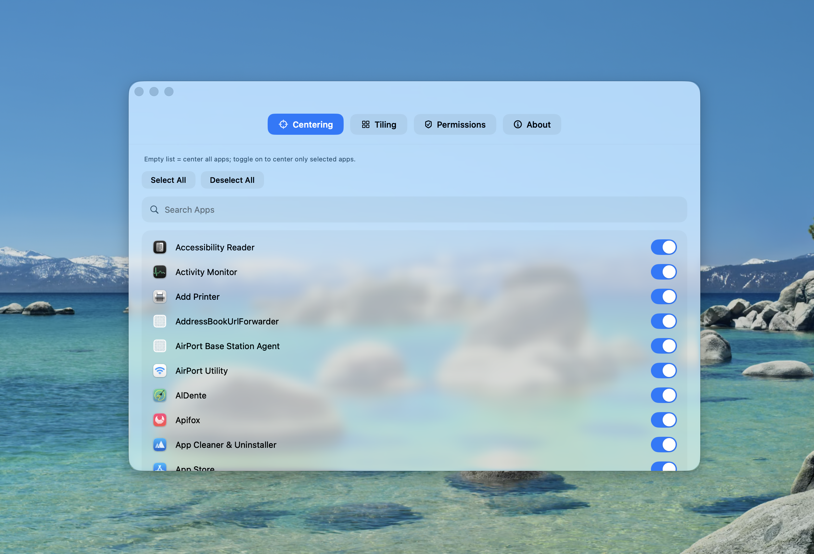
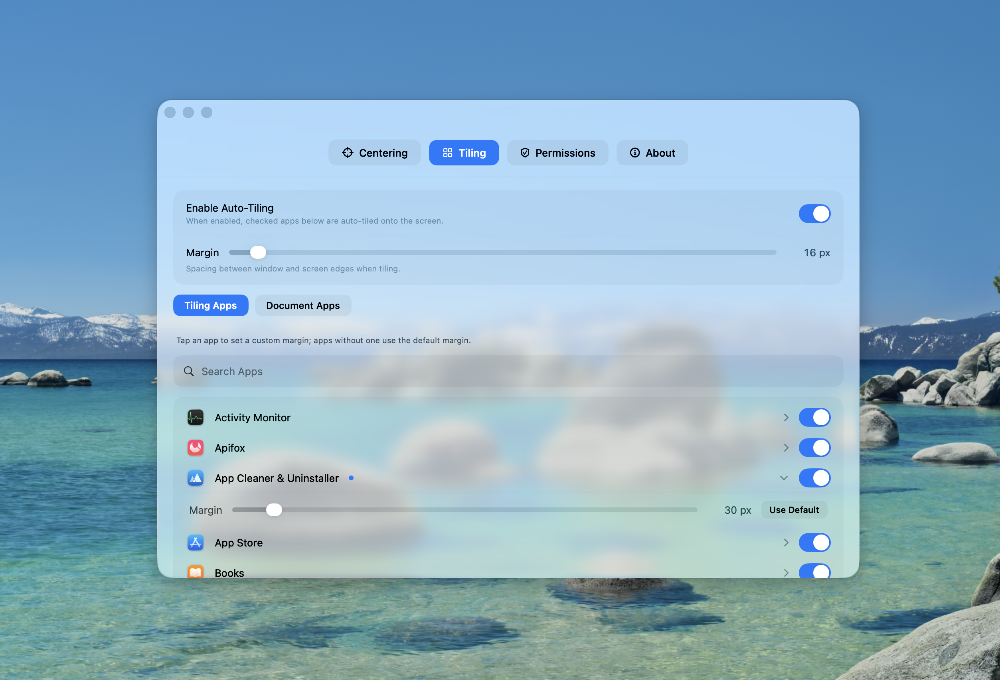

<div align="center">


# Plumb

Una línea desciende y encuentra su punto.

> Haz que tu Mac se sienta más elegante de usar.

Centra y coloca en mosaico las apps de macOS automáticamente — ¡una bendición para los amantes del orden!

[](./LICENSE)
[](#requisitos)
[](https://swift.org)
[](#descarga-e-instalación)

[English](./README.md) · [简体中文](./README.zh.md) · **Español** · [Français](./README.fr.md) · [日本語](./README.ja.md)

</div>

---

## 📖 Índice

- [Acerca de](#acerca-de)
- [✨ Funciones](#-funciones)
- [📐 Mosaico automático](#-mosaico-automático)
- [📸 Capturas](#-capturas)
- [Descarga e instalación](#descarga-e-instalación)
- [Uso](#uso)
- [Permisos](#permisos)
- [Requisitos](#requisitos)
- [Compilar localmente](#compilar-localmente)
- [Empaquetar y publicar](#empaquetar-y-publicar)
- [Preguntas frecuentes](#preguntas-frecuentes)
- [Licencia](#licencia)

## Acerca de

`Plumb` es un **gestor de ventanas en la barra de menús de macOS** que soporta tanto el centrado automático como el mosaico automático por aplicación.

Recibe el nombre de la **plomada** (plumb line) — el peso que el carpintero deja caer para encontrar la verdadera vertical, el verdadero centro. Eso es justo lo que hace Plumb: colocar suavemente una ventana en el centro exacto de la pantalla o en una posición designada.

- 🪧 Vive en la barra de menús — sin icono en el Dock, cero intrusiones
- 🎯 Centra una vez al iniciar, y después solo cuando se reabre una ventana o se enfoca una nueva
- 🖥️ Calcula dentro del área útil de la pantalla (excluye automáticamente el Dock y la barra de menús), estable en configuraciones multi-pantalla
- 📐 Mosaico automático por aplicación (lista de permitidas) con un margen uniforme configurable
- 🪟 Interfaz de ajustes Liquid Glass (macOS 26) — vidrio esmerilado, búsqueda de apps, interruptores en píldora

## ✨ Funciones

| Función | Descripción |
| --- | --- |
| 🎯 Centrar una vez | Centra una vez al iniciar; después solo cuando se reabre una ventana o se enfoca una nueva |
| ✋ No lucha con tu disposición | Arrastrar una ventana nunca vuelve a disparar el centrado |
| 🖥️ Evita con precisión el Dock/barra de menús | Basado en `screen.frame - screen.visibleFrame`, estable en multi-pantalla |
| 📐 Mosaico automático por app | Mecanismo de lista de permitidas con margen uniforme configurable (px) |
| 🎚️ Margen de mosaico por app | Toca cualquier app en mosaico para fijar un margen personalizado solo para esa app; las que no tengan ajuste usan el margen global predeterminado |
| 🔄 Refresco en vivo de la lista de apps | Las apps recién instaladas aparecen en el selector de ajustes de inmediato, sin reiniciar |
| 🪟 Interfaz Liquid Glass | Vidrio esmerilado de macOS 26, búsqueda, interruptores en píldora |
| 🧠 Detección inteligente de coordenadas | Detecta automáticamente el espacio de coordenadas de cada app y lo cachea para estabilidad |
| 🪧 Presencia no intrusiva en la barra de menús | Solo icono en la barra de menús, no ocupa el Dock |

## 📐 Mosaico automático

Abre `Ajustes de mosaico…` desde la barra de menús para activar/desactivar la función y gestionar tu flujo de trabajo.

- Configura un único margen uniforme (px)
- **Margen de mosaico por app**: toca cualquier app en la lista de mosaico para desplegar un cajón de margen integrado y fijar un margen personalizado solo para esa app; las apps sin ajuste personalizado siguen usando el margen global predeterminado. Un botón «Usar predeterminado» restablece una app al valor global.
- Selecciona las apps permitidas entre las aplicaciones instaladas (las apps del sistema se ocultan por defecto, conmutable)
- Para las apps permitidas, **el mosaico tiene prioridad** sobre el centrado automático
- El ámbito de disparo es una vez por inicio de proceso (PID); sin mosaico repetido dentro del mismo proceso
- Si una ventana no se puede redimensionar, se omite
- Las apps de documentos (Pages, Numbers, Word, Excel) omiten automáticamente el selector de plantillas/archivos; solo se coloca en mosaico el documento abierto

> La semántica está inspirada en los conceptos de configuración de Amethyst:
> - `window-margin-size`: equivalente al margen de mosaico de este proyecto
> - `floating + floating-is-blacklist=false`: equivalente al mosaico automático por lista de permitidas aquí

## 📸 Capturas

<table>
  <tr>
    <td width="50%" align="center"><b>Centrar — lista de apps permitidas</b></td>
    <td width="50%" align="center"><b>Mosaico — cajón de margen por app</b></td>
  </tr>
  <tr>
    <td width="50%" align="center"></td>
    <td width="50%" align="center"></td>
  </tr>
  <tr>
    <td width="100%" colspan="2" align="center"><b>Permisos — Accesibilidad, Grabación de pantalla, Inicio al iniciar sesión</b></td>
  </tr>
  <tr>
    <td width="100%" colspan="2" align="center"></td>
  </tr>
</table>

## Descarga e instalación

### Opción 1: Descargar el DMG (recomendado)

1. Descarga la última versión de `Plumb.dmg` desde [Releases](../../releases).
2. Abre el DMG y arrastra `Plumb.app` a `Applications`.
3. En `Applications`, haz clic derecho en `Plumb.app` → `Abrir` → vuelve a hacer clic en `Abrir`.
4. Si se bloquea, ve a `Ajustes del sistema → Privacidad y seguridad` y haz clic en "Abrir de todos modos".

### Opción 2: Compilar desde el código fuente

```bash
swift build -c release
./.build/release/Plumb
```

Consulta [Compilar localmente](#compilar-localmente).

## Uso

1. Tras el inicio, aparece un icono de gota de agua en la barra de menús.
2. Concede el permiso de [Accesibilidad](#accesibilidad) — el centrado depende de él.
3. (Opcional) Concede el permiso de [Grabación de pantalla](#grabación-de-pantalla) para mejorar la estabilidad de la detección de coordenadas en multi-pantalla.
4. Haz clic en el icono de la barra de menús:
   - Dispara el centrado manualmente
   - Abre `Ajustes de mosaico…` para configurar la lista de permitidas y el margen

> 💡 **Principio de diseño**: cada ventana se centra/coloca en mosaico **solo una vez** (con clave `pid:windowNumber`). Arrastrar manualmente una ventana nunca se "corrige" — Plumb no lucha con tu disposición manual.

## Permisos

### Accesibilidad

- **Ruta**: `Ajustes del sistema → Privacidad y seguridad → Accesibilidad`
- **Por qué es necesario**: La app usa las APIs de accesibilidad de macOS para leer el marco de la ventana frontal y escribir una nueva posición para centrarla.
- **Sin él**: La app no puede leer la geometría de la ventana ni mover ventanas, por lo que el centrado no funcionará.

### Grabación de pantalla

- **Ruta**: `Ajustes del sistema → Privacidad y seguridad → Grabación de pantalla`
- **Por qué es necesario**: La app necesita el contexto completo de la pantalla para calcular de forma fiable los límites de visualización utilizables y evitar el Dock/barra de menús al centrar.
- **Sin él**: El centrado dependiente del contexto de pantalla puede volverse inestable en multi-pantalla o disposiciones complejas.

### Límite de permisos

- ❌ La app **no sube contenido de la pantalla** y **no realiza recolección de telemetría**.
- ✅ Los permisos se usan **solo** para cálculos locales de geometría de ventanas y posicionamiento.

## Requisitos

- **macOS 26+** (compilado con el SDK de macOS 26 y la interfaz Liquid Glass; las versiones anteriores no son compatibles)
- Xcode Command Line Tools (`xcode-select --install`)

## Compilar localmente

```bash
# Ejecutar pruebas
swift test

# Compilar un binario Release
swift build -c release

# Ejecutar directamente
./.build/release/Plumb
```

## Empaquetar y publicar

### Empaquetar como .app y .dmg

```bash
scripts/build_app.sh      # produce dist/Plumb.app
scripts/create_dmg.sh     # produce dist/Plumb.dmg
```

El DMG incluye:

- `Plumb.app`
- `Applications` (acceso directo a la carpeta Applications del sistema)

> Instala arrastrando `Plumb.app` a `Applications`.

### Firmar y notarizar (Developer ID)

```bash
export DEVELOPER_ID_APP="Developer ID Application: YOUR_NAME (TEAMID)"
export NOTARY_PROFILE="AC_NOTARY"
scripts/sign_and_notarize.sh
```

### Flujo de publicación en un solo paso (para GitHub Releases)

```bash
export DEVELOPER_ID_APP="Developer ID Application: YOUR_NAME (TEAMID)"
export NOTARY_PROFILE="AC_NOTARY"
scripts/release_build.sh              # compilar + empaquetar + firmar/notarizar + verificar

GITHUB_TOKEN=... scripts/publish_release.sh v1.0.0   # publicar en GitHub Releases
```

> ⚠️ Los DMG no firmados/no notarizados pueden ser bloqueados por Gatekeeper en un Mac nuevo y aparecer como "dañados".

## Preguntas frecuentes

<details>
<summary><b>¿Aviso de "dañado" o "desarrollador no identificado" al abrir Plumb.app?</b></summary>

Este es el flujo normal de Gatekeeper para distribuciones no notarizadas — **no** es una corrupción del código de la app. Ejecuta:

```bash
xattr -dr com.apple.quarantine /Applications/Plumb.app
```

O ve a `Ajustes del sistema → Privacidad y seguridad` y haz clic en "Abrir de todos modos" al final.

</details>

<details>
<summary><b>¿El centrado no funciona?</b></summary>

Asegúrate de haber concedido el permiso de **Accesibilidad**: `Ajustes del sistema → Privacidad y seguridad → Accesibilidad`, y de que Plumb esté activado. Puede que necesites reiniciar Plumb tras concederlo.

</details>

<details>
<summary><b>¿El centrado de ventanas es impreciso en una configuración multi-pantalla?</b></summary>

Concede el permiso de **Grabación de pantalla**. Plumb usa la API `CGWindowList` como señal secundaria para identificar con mayor precisión la pantalla y el espacio de coordenadas de la ventana.

</details>

<details>
<summary><b>Arrastré una ventana y se volvió a centrar, ¿no?</b></summary>

No. Plumb centra/coloca en mosaico cada ventana **solo una vez** — las arrastradas manuales nunca se "corrigen".

</details>

## Licencia

Este proyecto es de código abierto bajo la [Licencia MIT](./LICENSE).

---

<div align="center">

[English](./README.md) · [简体中文](./README.zh.md) · **Español** · [Français](./README.fr.md) · [日本語](./README.ja.md)

Si Plumb te ayuda, se agradece un ⭐ Star.

</div>
