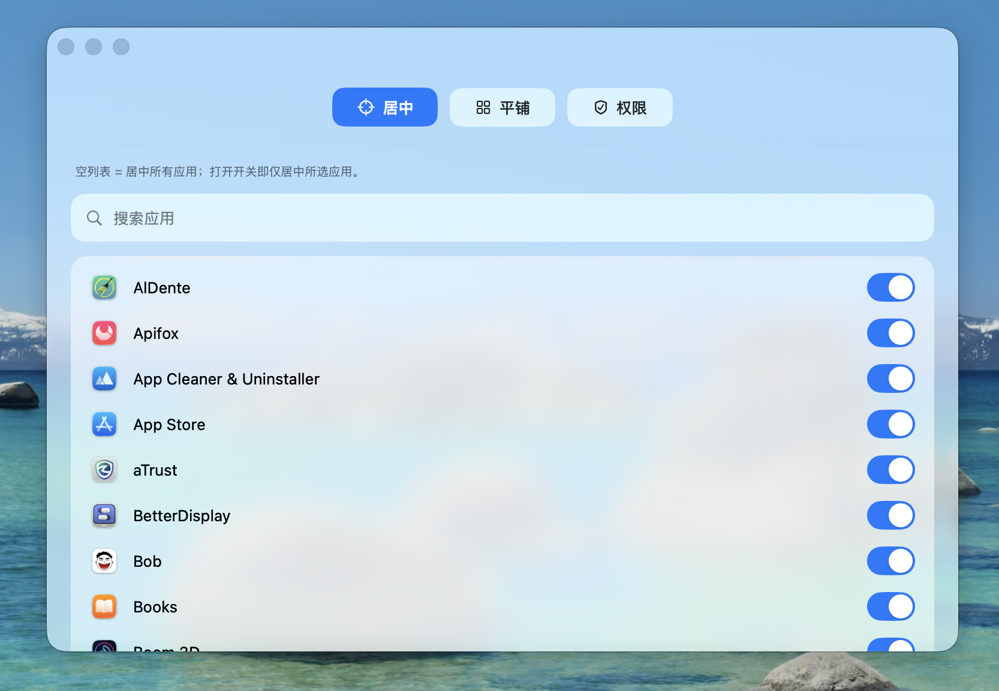

<div align="center">


# Plumb

一线垂下，落定正中。

> 让 Mac 使用起来变得更加优雅。

自动居中与平铺 macOS App，强迫症爱好者的福音！

[](./LICENSE)
[](#系统要求)
[](https://swift.org)
[](#下载安装)

[English](./README.en.md) · 简体中文 · [下载安装](#下载安装) · [使用说明](#使用说明) · [权限说明](#权限说明)

</div>

---

## 📖 目录

- [简介](#简介)
- [✨ 功能特性](#-功能特性)
- [📐 自动平铺](#-自动平铺)
- [📸 效果预览](#-效果预览)
- [下载安装](#下载安装)
- [使用说明](#使用说明)
- [权限说明](#权限说明)
- [本地构建](#本地构建)
- [打包与发布](#打包与发布)
- [常见问题](#常见问题)
- [开源协议](#开源协议)

## 简介

`Plumb` 是一个 **macOS 菜单栏窗口管理工具**：支持自动居中与按指定 App 自动平铺。

名字取自「铅锤线」（plumb line）——木匠把它垂下，用以找到真正的垂直与中心。Plumb 做的也正是这件事：把窗口温柔地安放到屏幕的正中或指定位置。

- 🪧 常驻菜单栏，无 Dock 图标，零打扰
- 🎯 启动即居中，之后仅在「窗口关闭后重新打开 / 切换到新窗口」时居中一次
- 🖥️ 基于可用屏幕区域计算（自动排除 Dock 与状态栏），多显示器场景稳定
- 📐 指定 App 自动平铺（白名单），可配置统一四边边距
- 🪟 Liquid Glass 设置界面（macOS 26），毛玻璃质感、应用搜索、药丸开关

## ✨ 功能特性

| 功能 | 说明 |
| --- | --- |
| 🎯 一次性居中 | 启动立即居中一次；之后仅在「窗口关闭后重新打开 / 切换到新窗口」时居中一次 |
| ✋ 不打扰手动布局 | 拖动移动窗口不会触发再次居中 |
| 🖥️ 精确避开 Dock/状态栏 | 基于 `screen.frame - screen.visibleFrame`，多屏稳定 |
| 📐 指定 App 自动平铺 | 白名单机制，可配置统一四边边距（px） |
| 🔄 实时刷新应用列表 | 新安装的应用立即出现在设置选择器中，无需重启 |
| 🪟 Liquid Glass 设置界面 | macOS 26 毛玻璃质感、搜索、药丸开关 |
| 🧠 四坐标系智能识别 | 自动识别不同 App 的窗口坐标系并稳定缓存 |
| 🪧 无打扰菜单栏驻留 | 仅菜单栏图标，不占用 Dock |

## 📐 自动平铺

在菜单栏 `平铺设置…` 中可开启/关闭功能，灵活管理你的工作流。

- 可配置统一四边距（px）
- 可从已安装应用列表中选择白名单 App（默认隐藏系统应用，可切换）
- 白名单 App 触发时**优先平铺**，不再自动居中
- 触发粒度为「每个进程首次窗口一次」；同一进程内后续不重复触发
- 若窗口不支持修改尺寸，则跳过该窗口

> 语义参考 Amethyst 配置思路：
> - `window-margin-size`：对应本项目平铺边距
> - `floating + floating-is-blacklist=false`：对应本项目「白名单自动平铺」

## 📸 效果预览

<table>
  <tr>
    <td width="50%" align="center"><b>Liquid Glass 设置界面</b></td>
    <td width="50%" align="center"><b>指定 App 自动平铺效果</b></td>
  </tr>
  <tr>
    <td width="50%" align="center"></td>
    <td width="50%" align="center"></td>
  </tr>
</table>

## 下载安装

### 方式一：下载 DMG（推荐）

1. 从 [Releases](../../releases) 下载最新版 `Plumb.dmg`。
2. 打开 DMG，将 `Plumb.app` 拖到 `Applications`。
3. 到 `Applications` 中右键 `Plumb.app` → `打开` → 再次点击 `打开`。
4. 若仍被拦截：前往 `系统设置 → 隐私与安全性`，页面底部点击「仍要打开」。

### 方式二：源码构建

```bash
swift build -c release
./.build/release/Plumb
```

详见 [本地构建](#本地构建)。

## 使用说明

1. 启动后，菜单栏出现水滴图标。
2. 授予 [辅助功能（Accessibility）](#辅助功能accessibility) 权限——居中功能依赖此权限。
3.（可选）授予 [屏幕录制（Screen Recording）](#屏幕录制screen-recording) 权限，以提升多显示器坐标识别稳定性。
4. 点击菜单栏图标：
   - 即可手动触发居中
   - 打开 `平铺设置…` 配置白名单与边距

> 💡 **设计原则**：每个窗口只居中/平铺**一次**（以 `pid:windowNumber` 为键记录）。你手动拖动窗口不会被「纠正」回来——Plumb 不打扰你的手动布局。

## 权限说明

### 辅助功能（Accessibility）

- **路径**：`系统设置 → 隐私与安全性 → 辅助功能`
- **为什么需要**：应用通过 macOS Accessibility API 读取前台窗口的位置/尺寸，并写入新位置来执行「窗口居中」。
- **不授权会怎样**：无法获取窗口几何信息，也无法移动窗口，居中功能不可用。

### 屏幕录制（Screen Recording）

- **路径**：`系统设置 → 隐私与安全性 → 屏幕录制`
- **为什么需要**：需要获取完整屏幕可见区域上下文，以便正确识别可用显示区域并精确避开 Dock/状态栏进行居中。
- **不授权会怎样**：屏幕上下文能力受限，可能导致多屏或复杂布局下的居中判断不稳定。

### 权限边界说明

- ❌ 本项目**不会上传屏幕内容**，**不会进行网络采集**。
- ✅ 权限**仅用于**本地窗口几何计算与窗口位置调整。

## 系统要求

- macOS 13+（Liquid Glass 设置界面需 macOS 26）
- Xcode Command Line Tools（`xcode-select --install`）

## 本地构建

```bash
# 运行测试
swift test

# 构建 Release 版本
swift build -c release

# 直接运行
./.build/release/Plumb
```

## 打包与发布

### 打包为 .app 与 .dmg

```bash
scripts/build_app.sh      # 生成 dist/Plumb.app
scripts/create_dmg.sh     # 生成 dist/Plumb.dmg
```

DMG 打开后包含两个项目：

- `Plumb.app`
- `Applications`（系统应用目录快捷方式）

> 安装方式：将 `Plumb.app` 拖到 `Applications`。

### 签名与公证（Developer ID）

```bash
export DEVELOPER_ID_APP="Developer ID Application: YOUR_NAME (TEAMID)"
export NOTARY_PROFILE="AC_NOTARY"
scripts/sign_and_notarize.sh
```

### 一键发布流程（用于 GitHub Releases）

```bash
export DEVELOPER_ID_APP="Developer ID Application: YOUR_NAME (TEAMID)"
export NOTARY_PROFILE="AC_NOTARY"
scripts/release_build.sh              # 构建 + 打包 + 签名公证 + 校验

GITHUB_TOKEN=... scripts/publish_release.sh v1.0.0   # 发布到 GitHub Releases
```

> ⚠️ 未签名/未公证的 DMG 在新 Mac 上可能被 Gatekeeper 拦截，可能显示「已损坏」。

## 常见问题

<details>
<summary><b>打开 Plumb.app 时提示「已损坏」或「无法验证开发者」？</b></summary>

这是非公证分发的常见 Gatekeeper 流程，**不是应用自身代码损坏**。可执行：

```bash
xattr -dr com.apple.quarantine /Applications/Plumb.app
```

或前往 `系统设置 → 隐私与安全性`，点击页面底部的「仍要打开」。

</details>

<details>
<summary><b>居中功能不生效？</b></summary>

请检查是否已授予 **辅助功能（Accessibility）** 权限：`系统设置 → 隐私与安全性 → 辅助功能`，并确保 Plumb 处于开启状态。授权后可能需要重启 Plumb。

</details>

<details>
<summary><b>多显示器场景下窗口居中位置不准？</b></summary>

请授予 **屏幕录制（Screen Recording）** 权限，Plumb 会通过 `CGWindowList` API 作为辅助信号来更精确地识别窗口所属屏幕与坐标系。

</details>

<details>
<summary><b>我手动拖动了窗口，又被自动居中回来了？</b></summary>

不会。Plumb 对每个窗口只居中/平铺**一次**，手动拖动不会被「纠正」。

</details>

## 开源协议

本项目基于 [MIT License](./LICENSE) 开源。

---

<div align="center">

**[English](./README.en.md)** · 简体中文

如果 Plumb 对你有帮助，欢迎 ⭐ Star 支持。

</div>
